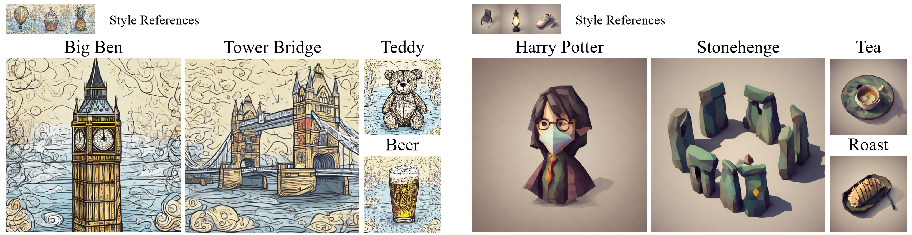

## StyleBlend: Enhancing Style-Specific Content Creation in Text-to-Image Diffusion Models

<div align="center">
 <!-- <a href='https://arxiv.org/abs/2502.....'></a> &nbsp;&nbsp;&nbsp;&nbsp;&nbsp; -->
 <a href='https://zichongc.github.io/StyleBlend/'></a>
</div>
<br></br>
<!--  -->


**TL;DR:** A finetuning-based approach for style-specific text-to-image generation that ensures robust style consistency and aligns textual semantics.

### ⚙️ Getting Started 

#### Steup
```
conda create -n styleblend python=3.10
conda activate styleblend
pip install -r requirements.txt
```

#### Configure Parameters
* Specify the `configs/training_config_sd21.yaml` file to adjust training parameters as needed.
* Specify the `configs/inference_config_sd21.yaml` file to adjust inference parameters.

The `parameters.json` file provides additional parameters for example styles used during  inference. These parameters are configured in the `styleblend_sd.ipynb` inference script.

### 🔥 Style Representation Learning
Run `style_learning.ipynb` step by step to capture composition and texture styles.

#### Train Your Own Style
1. Organize your style images
   1. Name your style and create a folder `./data/[YOUR_STYLE_NAME]`  to store the images.
   2. Rename your style images. Use one or a few words to describe the content of each image, and name the style image in the format `[DESCRIPTION].png`. If there are multiple words, use underscores to replace spaces, for example `[DESC1_DESC2].png`.
2. Run `style_learning.ipynb` step by step.

### 💫 Inference
Run `styleblend_sd.ipynb` step by step for inference.


###  BibTex
```
@inproceedings{chen2025styleblend,
  title = {StyleBlend: Enhancing Style-Specific Content Creation in Text-to-Image Diffusion Models},
  author = {Zichong Chen, Shijin Wang, Yang Zhou},
  booktitle = {Eurographics},
  year = {2025}
}
```
